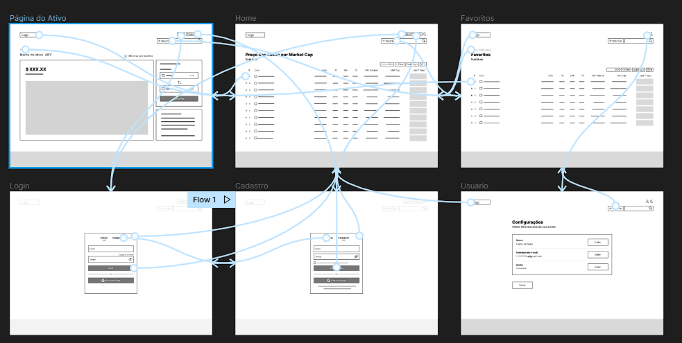
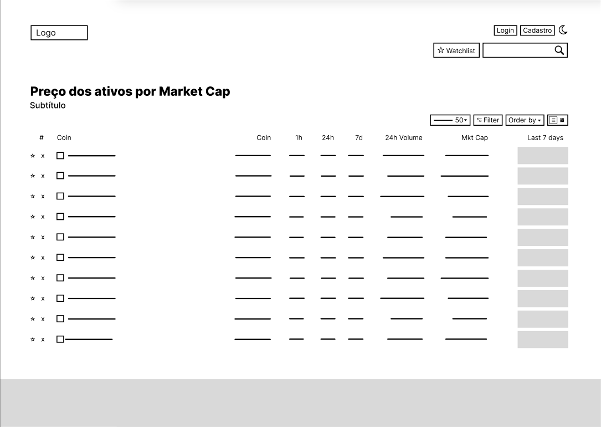
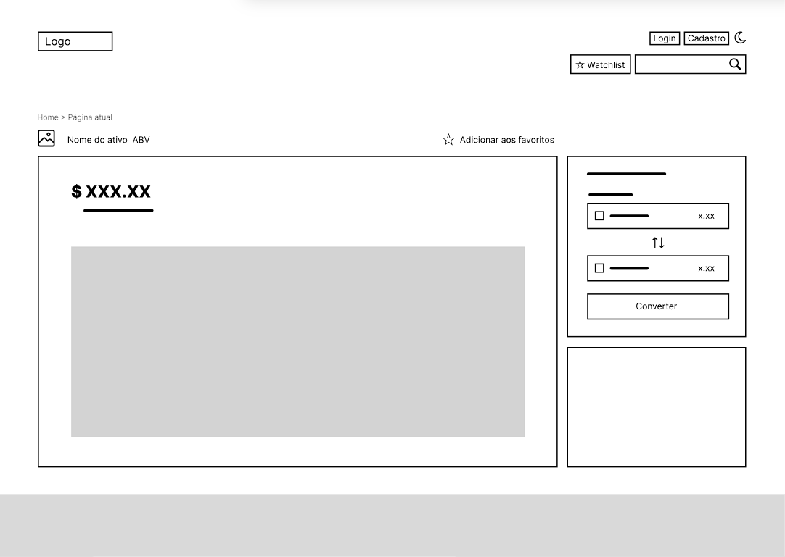
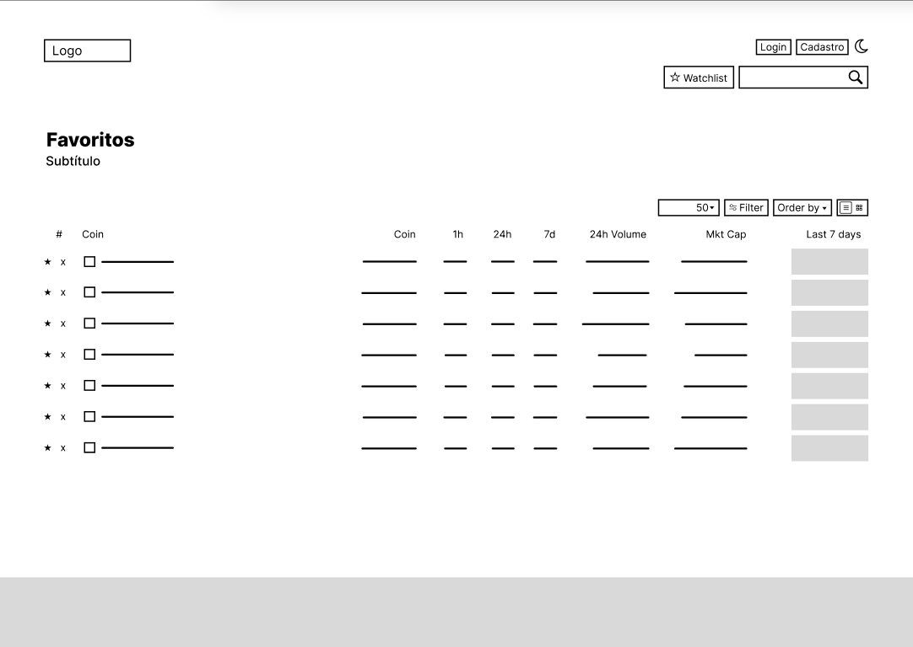
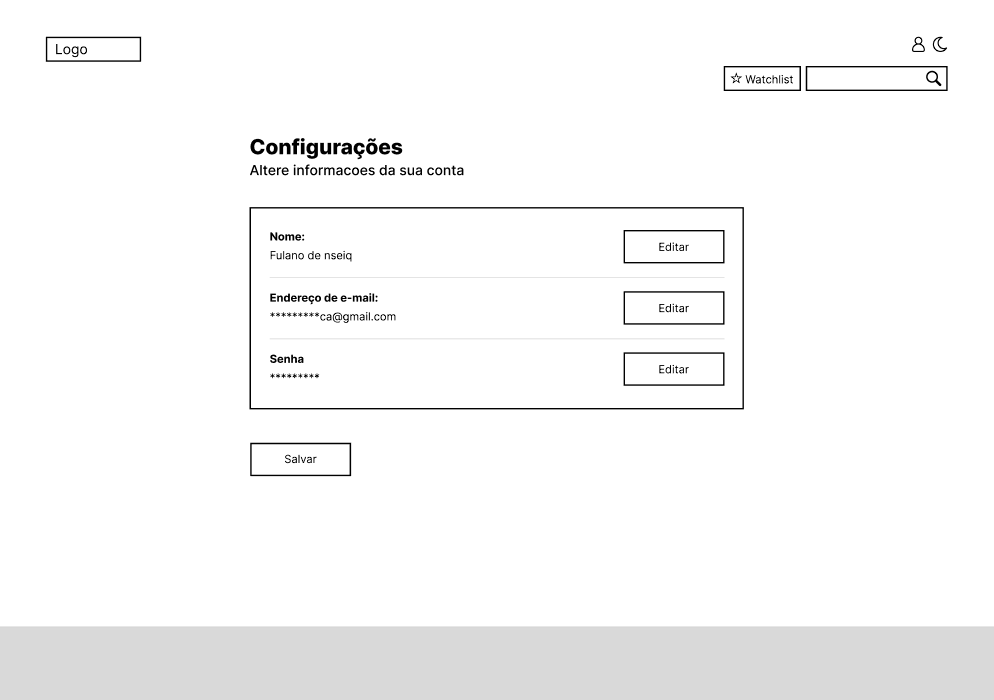
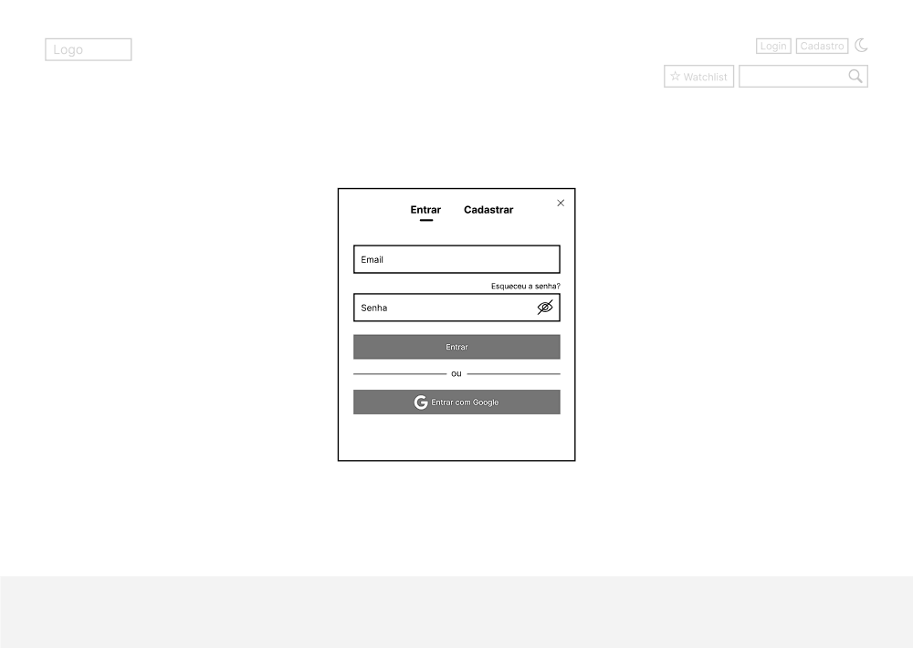
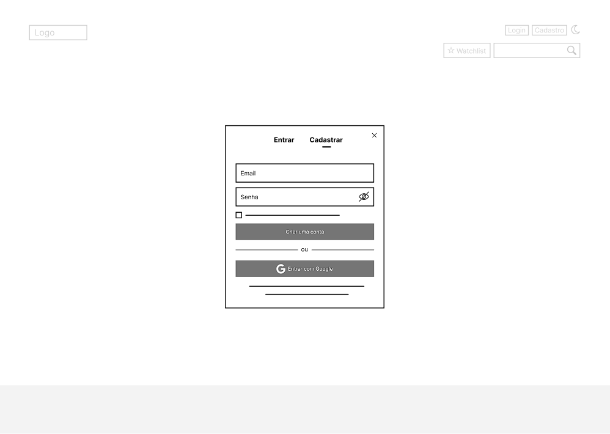

# Projeto de Interface

Pré-requisitos: <a href="2-Especificação do Projeto.md"> Documentação de Especificação</a>

Visão geral da interação do usuário pelas telas do sistema e protótipo interativo das telas com as funcionalidades que fazem parte do sistema (wireframes).

 Apresente as principais interfaces da plataforma. Discuta como ela foi elaborada de forma a atender os requisitos funcionais, não funcionais e histórias de usuário abordados nas <a href="2-Especificação do Projeto.md"> Documentação de Especificação</a>.

## User Flow

Fluxo de usuário (User Flow) é uma técnica que permite ao desenvolvedor mapear todo fluxo de telas do site ou app. Essa técnica funciona para alinhar os caminhos e as possíveis ações que o usuário pode fazer junto com os membros de sua equipe.

> **Links Úteis**:
> - [User Flow: O Quê É e Como Fazer?](https://medium.com/7bits/fluxo-de-usu%C3%A1rio-user-flow-o-que-%C3%A9-como-fazer-79d965872534)
> - [User Flow vs Site Maps](http://designr.com.br/sitemap-e-user-flow-quais-as-diferencas-e-quando-usar-cada-um/)
> - [Top 25 User Flow Tools & Templates for Smooth](https://www.mockplus.com/blog/post/user-flow-tools)

## Wireframes

<b>Tela - Home-Page</b>

A tela de home-page mostra os ativos financeiros de destaque a partir da API utilizada pelo sistema. Com base na estrutura padrão, a lista traz os ativos financeiros por ordem de popularidade com as colunas (Coin, 1h, 24h, 7d, 24h Volume, MktCap, Last 7 days chart). 

No canto superior direito da lista de ativos temos os seguintes elementos:
Dropdown para alterar a quantidade de ativos a serem visualizados por página, Botão de filtro de categoria, Dropdown de ordenação de ativos financeiros, Botão para alterar visualização de lista para grade ou vice-versa.

No canto superior direito da página temos os seguintes elementos:
Botão de Login, Botão de Cadastro, Botão de Dark Mode, Botão de WatchList, Componente de pesquisa que permite substituir o conteúdo da página com o resultado da busca solicitada pelo usuário.

<b>Tela - Página do Ativo</b>

A página do ativo apresenta a figura que o representa à esquerda e o botão de adicionar aos favoritos à direita. No bloco esquerdo, é mostrado o valor atual em em negrito e sublinhado, com um gráfico de linha ampliado apresentando o histórico do ativo financeiro. No bloco superior direito, é mostrado um conversor do ativo escolhido para uma moeda padrão.

<b>Tela - Favoritos</b>

A tela de favoritos mostra os ativos financeiros favoritados pelo usuário. Com base na estrutura padrão, a lista traz os ativos financeiros por ordem de escolha com as colunas (Coin, 1h, 24h, 7d, 24h Volume, MktCap, Last 7 days chart). 

No canto superior direito da lista de ativos temos os seguintes elementos:
Dropdown para alterar a quantidade de ativos a serem visualizados por página, Botão de filtro de categoria, Dropdown de ordenação de ativos financeiros, Botão para alterar visualização de lista para grade ou vice-versa.

No canto superior direito da página temos os seguintes elementos:
Botão de Login, Botão de Cadastro, Botão de Dark Mode, Botão de WatchList, Componente de pesquisa que permite substituir o conteúdo da página com o resultado da busca solicitada pelo usuário.

<b>Tela - Usuário</b>

A tela de usuário apresenta no Bloco de Conteúdo: Nome, o Endereço de e-mail e a Senha, com botões de edição de conteúdo à direita. Abaixo do bloco de conteúdo, é apresentado um botão para salvar as alterações.

<b>Tela - Login</b>

Na tela de login, são apresentados os campos de Email e senha, um link “Esqueceu a senha”, um botão para visualizar ou esconder a senha, um botão para entrar com o usuário e senha cadastrados previamente e um botão para fazer login com a conta Google.

<b>Tela - Cadastro</b>

Na tela de Cadastro, são apresentados os campos de Email e senha, uma caixa de seleção para concordar com os termos de uso, um botão para visualizar ou esconder a senha, um botão para criar o usuário e um botão para fazer login com a conta Google.

 
> **Links Úteis**:
> - [Protótipos vs Wireframes](https://www.nngroup.com/videos/prototypes-vs-wireframes-ux-projects/)
> - [Ferramentas de Wireframes](https://rockcontent.com/blog/wireframes/)
> - [MarvelApp](https://marvelapp.com/developers/documentation/tutorials/)
> - [Figma](https://www.figma.com/)
> - [Adobe XD](https://www.adobe.com/br/products/xd.html#scroll)
> - [Axure](https://www.axure.com/edu) (Licença Educacional)
> - [InvisionApp](https://www.invisionapp.com/) (Licença Educacional)
