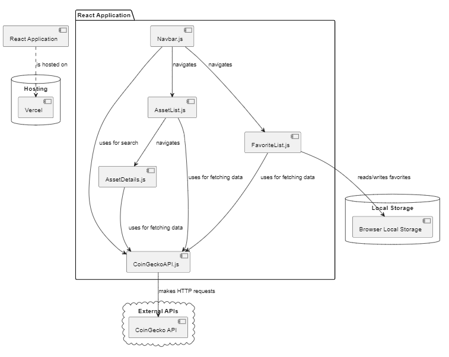

# Arquitetura da Solução

Pré-requisitos: <a href="3-Projeto de Interface.md"> Projeto de Interface</a>

Definição de como o software é estruturado em termos dos componentes que fazem parte da solução e do ambiente de hospedagem da aplicação.

## Diagrama de componentes

Diagrama que permite a modelagem física de um sistema, através da visão dos seus componentes e relacionamentos entre os mesmos.

Exemplo:

Os componentes que fazem parte da solução são apresentados na Figura 01.

Figura 01 - Arquitetura da Solução

A solução implementada conta com os seguintes módulos:

- **Navbar.js** - Este é o componente de navegação superior da aplicação. Ele contém links para as diferentes páginas da aplicação (lista de favoritos, lista de ativos) e também possui um campo de pesquisa que interage com a API CoinGecko para buscar ativos. Além disso, também apresenta botões de Login, Cadastro e alternância de tema.

- **FavoriteList.js** - Este componente é responsável por exibir a lista de ativos favoritos do usuário. Ele busca os ativos favoritos do local storage do navegador e os exibe em uma tabela. Os usuários podem adicionar ou remover ativos de seus favoritos clicando no ícone de estrela na tabela. Este componente também usa a API CoinGecko para buscar informações atualizadas sobre os ativos.

- **AssetList.js** - Este componente é a interface que lista todos os ativos disponíveis. Ele também usa a API CoinGecko para buscar informações sobre os ativos e permite ao usuário adicionar ativos à sua lista de favoritos.

- **AssetDetails.js** - Este componente exibe informações detalhadas sobre um ativo específico selecionado pelo usuário na lista de ativos obtidos através da API CoinGecko.

- **CoinGeckoAPI.js** - Este módulo é responsável por fazer todas as chamadas para a API CoinGecko. Ele possui funções para buscar a lista de ativos, informações detalhadas de um ativo específico e dados de gráfico de um ativo.

- **CoinGecko API** - Esta é a API externa usada pela aplicação. Ela fornece informações atualizadas sobre várias criptomoedas (e.g. preços).

- **Vercel** - Este é o serviço de hospedagem onde a aplicação React é publicada e acessada pelos usuários. Ele hospeda os arquivos estáticos (HTML, CSS, JavaScript) gerados pelo aplicativo React.

- **React Application** - Este é o aplicativo React em si, que é composto pelos componentes e módulos listados acima. Ele é hospedado no Vercel e interage com a API CoinGecko para fornecer a funcionalidade desejada aos usuários.

- **Browser Local Storage** - Este é o mecanismo de armazenamento no navegador do usuário. É usado para armazenar dados localmente no navegador do usuário. No contexto desta aplicação, é utilizado para armazenar a lista de ativos favoritos do usuário. O componente FavoriteList.js interage com o Local Storage para ler e escrever a lista de ativos favoritos do usuário. Este armazenamento persiste mesmo após o navegador ser fechado e reaberto, o que permite que a aplicação mantenha o estado dos favoritos do usuário entre diferentes sessões de navegação.
  >

## Tecnologias Utilizadas

As tecnologias utilizadas no projeto incluem:

- **Linguagens** - JavaScript, HTML e CSS.
- **Bibliotecas e frameworks** - React, Material-UI e Recharts.
- **Serviços web** - CoinGecko API.
- **IDE** - Visual Studio Code.

A interação do usuário com o sistema é conduzida por meio de uma aplicação React. A estrutura do projeto inclui diferentes componentes, como AssetList, AssetDetails e FavoritesList, que são renderizados em diferentes rotas da aplicação usando o React Router (BrowserRouter).

Quando o usuário acessa a rota inicial (/), o componente AssetList é renderizado e faz uma requisição à CoinGecko API para obter a lista de ativos. Essa lista é exibida em uma tabela, onde o usuário pode pesquisar por ativos específicos. Além disso, o usuário pode marcar ativos como favoritos clicando no ícone de estrela.

Ao clicar em um ativo na lista, o usuário é direcionado para a rota /asset/:id, onde o componente AssetDetails é renderizado. Esse componente exibe os detalhes do ativo selecionado, incluindo seu nome e um gráfico de linha com dados de preços históricos. Também é possível marcar ou desmarcar o ativo como favorito.

A rota /favorites renderiza o componente FavoritesList, que exibe uma lista dos ativos marcados como favoritos. Essa lista é atualizada automaticamente com base nas seleções feitas nas outras telas.

O componente Navbar é utilizado em todas as rotas e permite ao usuário realizar ações como acessar a lista de favoritos, fazer buscas por ativos e alternar entre os modos de tema claro e escuro.

O usuário interage com a interface do usuário construída com o React e o Material-UI. Quando o usuário realiza uma ação, como pesquisar um ativo ou adicionar um ativo aos favoritos, o estado do componente React é atualizado, causando uma nova renderização da interface do usuário. Se a ação do usuário necessita de dados que não estão atualmente na aplicação, uma solicitação HTTP é feita à API do CoinGecko usando o Axios. Os dados retornados da API são então usados para atualizar o estado do componente React e a interface do usuário é novamente renderizada com os novos dados. Quando o usuário adiciona um ativo aos seus favoritos, a lista de favoritos é armazenada no Local Storage, permitindo que esses dados persistam entre as sessões de navegação. As rotas do aplicativo são gerenciadas pelo React Router, permitindo ao usuário navegar entre diferentes visualizações sem a necessidade de carregar uma nova página.

Em resumo, as tecnologias utilizadas permitem a criação de uma aplicação web interativa que consome dados da CoinGecko API para exibir informações sobre criptoativos, permitindo ao usuário visualizar, pesquisar e favoritar ativos.

O diagrama de interação está disponível na figura 2 abaixo:

## Hospedagem

O site utiliza a plataforma do Vercel como ambiente de hospedagem do site do projeto. O site é mantido no ambiente da URL:

https://pmv-ads-2023-1-e1-proj-web-t13-proj-web-t13-investfl-5c0lm070m.vercel.app/

A publicação do site no Vercel é feita por meio de uma submissão do projeto (push) via git para o repositório remoto que se encontra no endereço.
