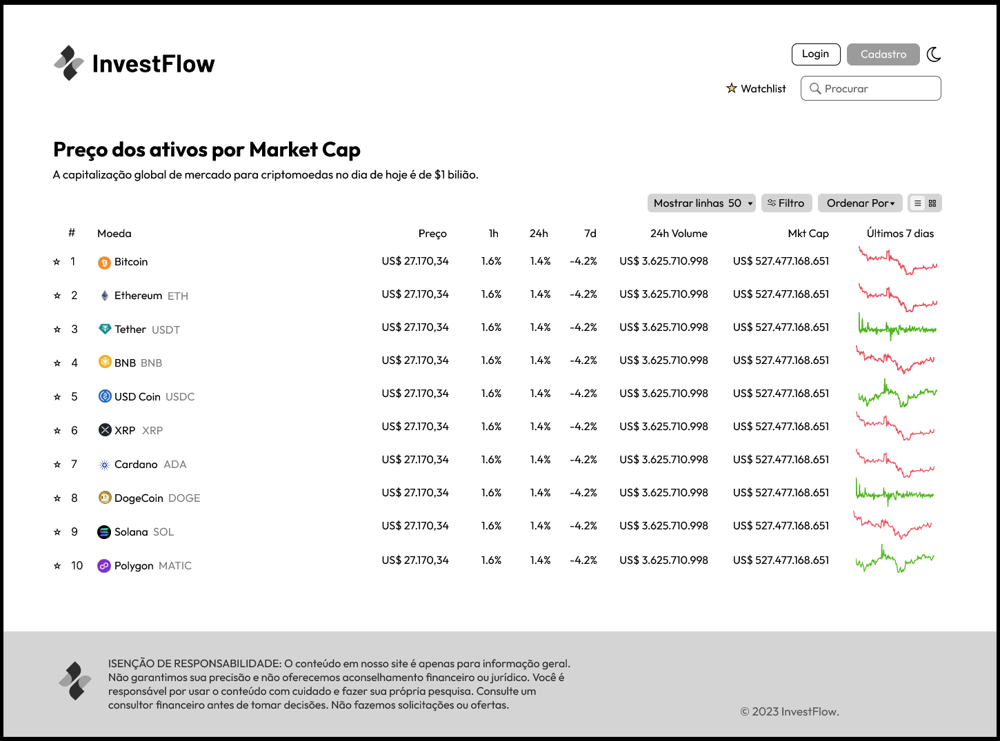
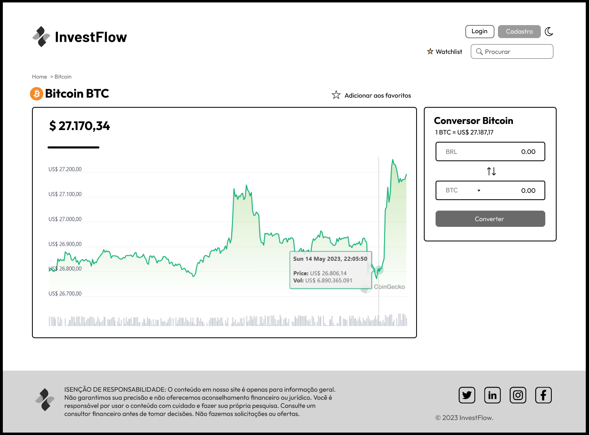
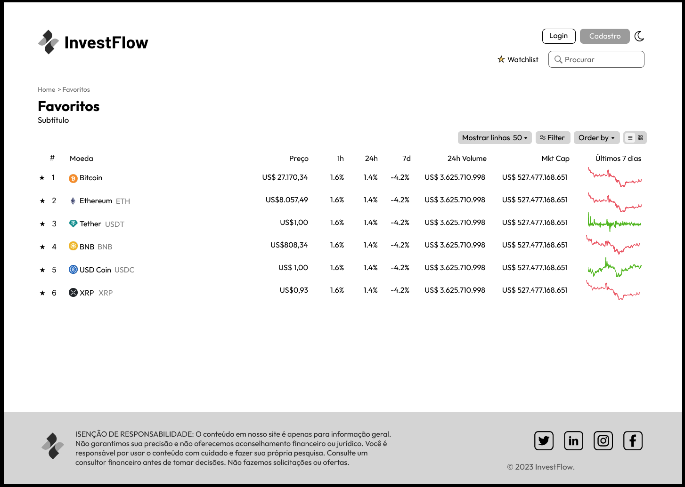

# Template padrão do site

Pré-requisitos: <a href="2-Especificação do Projeto.md"> Especificação do Projeto</a>, <a href="3-Projeto de Interface.md"> Projeto de Interface</a>, <a href="4-Metodologia.md"> Metodologia</a>

Layout padrão do site (HTML e CSS) que será utilizado em todas as páginas com a definição de identidade visual, aspectos de responsividade e iconografia, tem correspondência ao projeto de Interface elaborado anteriormente, conforme a seção “Wireframes”.

O template criado está disponível no site Figma e é composto pelos seguintes layouts: 
* Tela principal
* Página do ativo
* Favoritos

## Tela Principal

Tela que abrange todas as visualizações iniciais do site, contendo uma lista dos Criptoativos e suas respectivas informações, assim como botões de Login e acesso a página de favoritos.

## Página do Ativo

O usuário é direcionado a essa página ao selecionar qualquer um dos ativos listados na Pagina inicial ou na página de Favoritos.

Essa tela exibe as informações pertinentes a um ativo específico.

## Tela de Favoritos

Semelhante a tela inicial, a tela de Favoritos lista somente os ativos favoritados pelo usuário a partir do botão de estrela. É possível notar que nessa página, todos os ativos possuem o botão marcado.

## Tela de Login

TESTETESTE

> **Links Úteis**:
>
> - [CSS Website Layout (W3Schools)](https://www.w3schools.com/css/css_website_layout.asp)
> - [Website Page Layouts](http://www.cellbiol.com/bioinformatics_web_development/chapter-3-your-first-web-page-learning-html-and-css/website-page-layouts/)
> - [Perfect Liquid Layout](https://matthewjamestaylor.com/perfect-liquid-layouts)
> - [How and Why Icons Improve Your Web Design](https://usabilla.com/blog/how-and-why-icons-improve-you-web-design/)