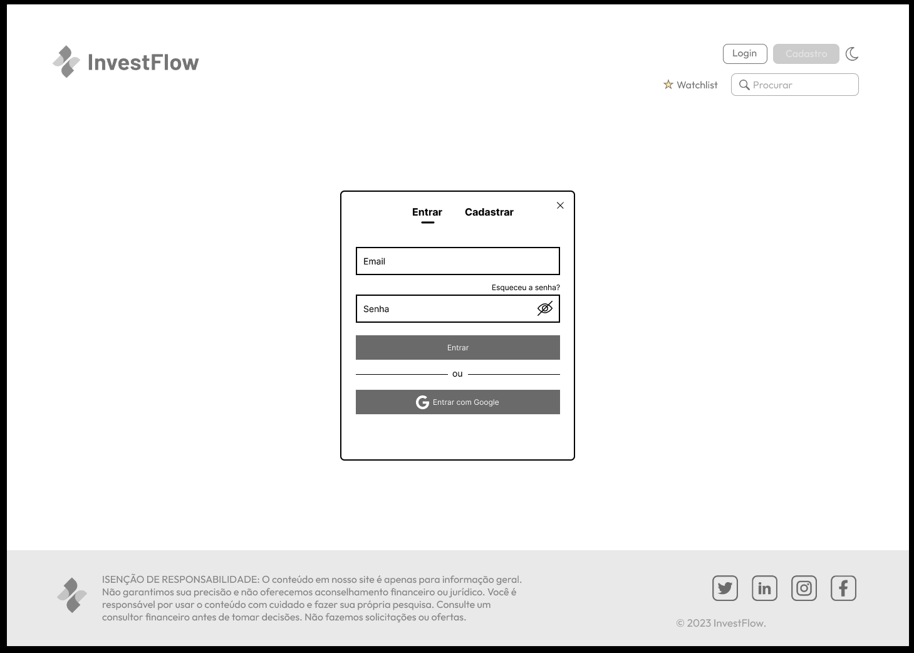
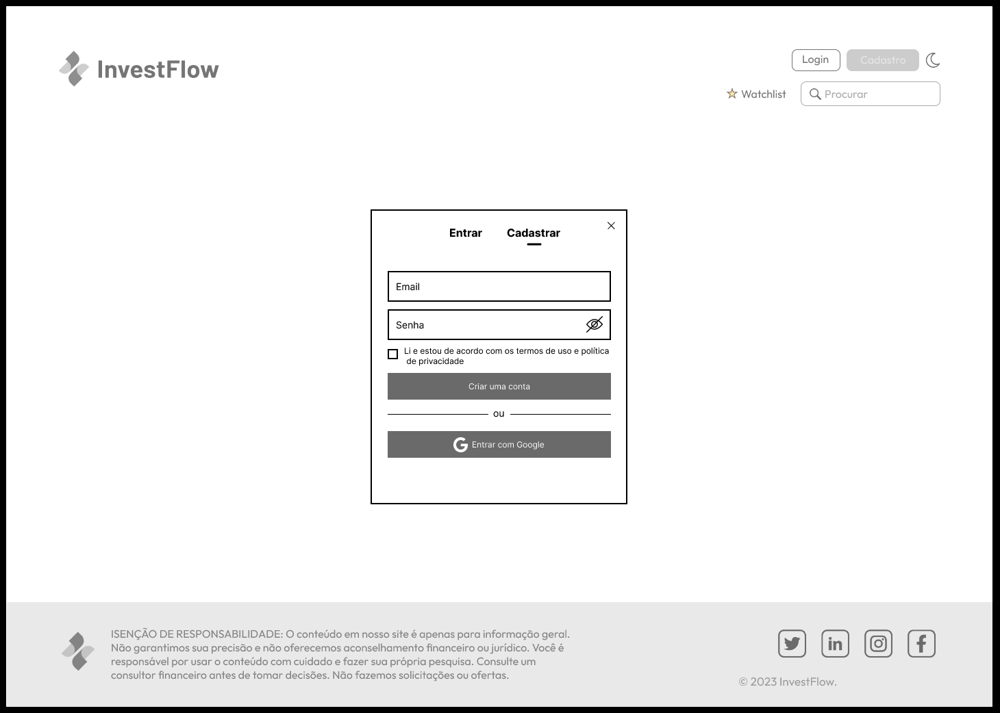
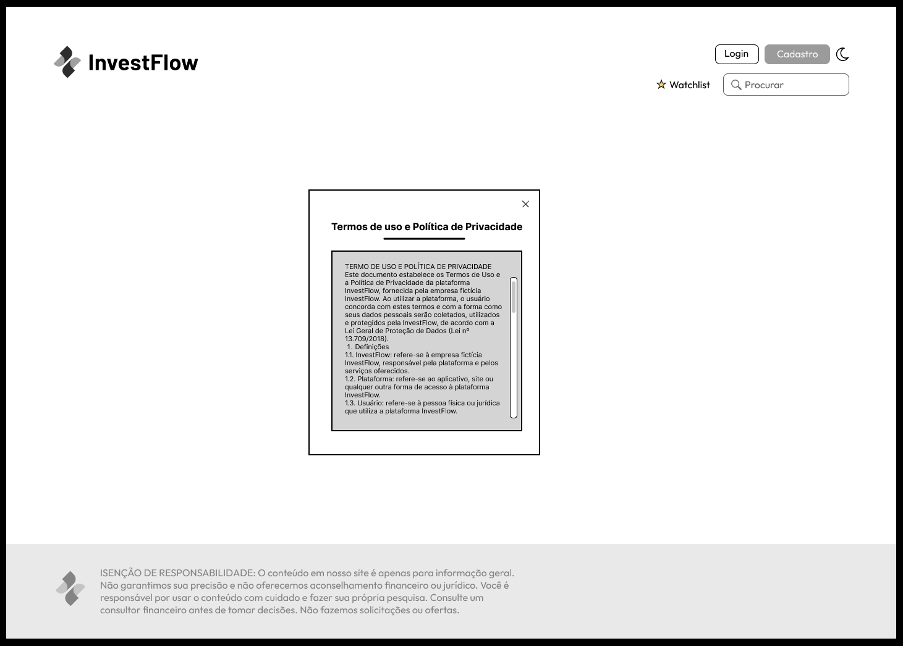

# Template padrão do site

Pré-requisitos: <a href="2-Especificação do Projeto.md"> Especificação do Projeto</a>, <a href="3-Projeto de Interface.md"> Projeto de Interface</a>, <a href="4-Metodologia.md"> Metodologia</a>

Layout padrão do site (HTML e CSS) que será utilizado em todas as páginas com a definição de identidade visual, aspectos de responsividade e iconografia, tem correspondência ao projeto de Interface elaborado anteriormente, conforme a seção “Wireframes”.

O template criado está disponível no site Figma e é composto pelos seguintes layouts: 
* Tela principal
* Página do ativo
* Favoritos
* Tela de Login
* Tela de Cadastro
* Tela com os Termos de Uso e Política de Privacidade

## Tela Principal

Tela que abrange todas as visualizações iniciais do site, contendo uma lista dos Criptoativos e suas respectivas informações, assim como botões de Login e acesso a página de favoritos.

## Página do Ativo

O usuário é direcionado a essa página ao selecionar qualquer um dos ativos listados na Pagina inicial ou na página de Favoritos.

Essa tela exibe as informações pertinentes a um ativo específico.

## Tela de Favoritos

Semelhante a tela inicial, a tela de Favoritos lista somente os ativos favoritados pelo usuário a partir do botão de estrela. É possível notar que nessa página, todos os ativos possuem o botão marcado.

## Tela de Login

A tela de Login consiste em um Widget que toma o foco da página onde o usuário se encontra, dando a possibilidade de entrar com Email e Senha ou autenticar por meio do Google.

## Tela de Cadastro

Ao selecionar o botão de Cadastro, o usuário é apresentado com uma Widget muito similar a de Login, onde há a possibilidade de cadastrar email e senha e um checkbox para marcar após leitura dos termos de uso e política de privacidade

## Tela de Termos de Uso

A tela de Termos de Uso consiste numa Widget que contém um documento com os Termos de Uso e Política de Privacidade do site, em acordo com as normas regidas pela Lei Geral de Proteção de Dados.

> **Links Úteis**:
>
>
> - [CSS Website Layout (W3Schools)](https://www.w3schools.com/css/css_website_layout.asp)
> - [Website Page Layouts](http://www.cellbiol.com/bioinformatics_web_development/chapter-3-your-first-web-page-learning-html-and-css/website-page-layouts/)
> - [Perfect Liquid Layout](https://matthewjamestaylor.com/perfect-liquid-layouts)
> - [How and Why Icons Improve Your Web Design](https://usabilla.com/blog/how-and-why-icons-improve-you-web-design/)
> - [O que é LGPD](https://www.mpf.mp.br/servicos/lgpd/o-que-e-a-lgpd)